# Projeto final de Cálculo 1 | Grupo Desconfigurados !

Turma 07/24, integrantes (colocar no fim do readme na ultima edicao)
Esse repositório foi uma forma que encontramos de poder compartilhar nosso projeto, seu funcionamento e uma mini documentação à parte do relatório oficial. 🧐

# Ideia do projeto

  * Depois de tantas ideias e debates, chegamos em uma conclusão de criar algoritmo capaz de simular lançamentos em de "Foguetes de garrafas pet" (mal sabiamos o quanto essa ideia escalaria 😅). Durante as reuniões e desenvolvimento surgiram diversas outras ideias das quais algumas foram aplicadas e outras ficaram para uma possibilidade futura.
  * Nosso produto final é um algoritmo que realiza simulações de lançamentos na lua terrestre e em diferentes planetas do sistema solar 🪐

## Utilização

Nossa aplicação será portada para dispositivos móveis, já que é onde a maioria das pessoas têm maior tempo de conexão no dia a dia.

  

## Linguagens, bibliotecas e frameworks utilizados

Até o momento nosso algoritmo roda em python puro com as bibliotecas matplotlib, numpy e math. Futuramente iremos migrar para outra linguagem ou implementar um framework mais robusto.

### Integrantes da equipe:  
Deividi Santos:  .

Icaro Pereira:  .

Ilmara Vitoria:  .

Laura Mendes:  .

Renato Hortêncio: [LinkedIn](https://www.linkedin.com/in/renato-hort%C3%AAncio/) [GitHub](github.com/RenatoHort)
>usar barras e parenteses para embed de links

## Como usar UML

You can render UML diagrams using [Mermaid](https://mermaidjs.github.io/). For example, this will produce a sequence diagram:

```mermaid
flowchart TD
    A("Início do app") --> B("Inserção dos dados")
    B --> C("Carregamento da aplicação")
    C --> D["fa:fa-rocket Resultados do lançamento"]
    D -- "Encontrar Vel. Instant." --> E("Cálculo da velocidade")
    D -- Finalizar --> G("fa:fa-comment-dots Fim da aplicação")
    E -- Finalizar --> G
    D@{ shape: rounded}
    style G color:#FFFFFF, stroke:#00C853, fill:#00C853,stroke:#000000,fill:#616161
```

And this will produce a flow chart:

