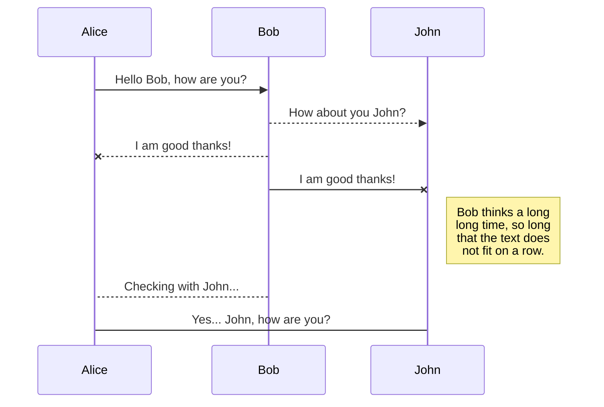
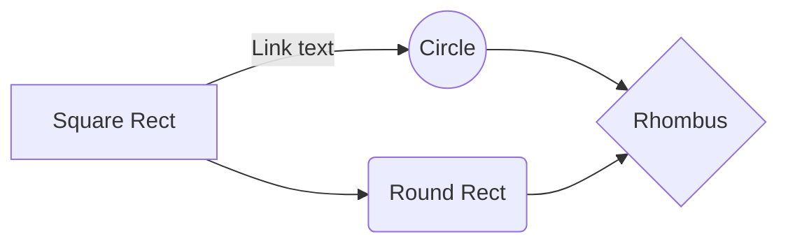

# Projeto final de Cálculo 1 | Grupo {nome do grupo} !

Turma 07/24, integrantes (colocar no fim do readme na ultima edicao)
Esse repositório foi uma forma que encontramos de poder compartilhar nosso projeto, seu funcionamento e uma mini documentação à parte do relatório oficial. 🧐

# Ideia do projeto

  * Depois de tantas ideias e debates, chegamos em uma conclusão de criar algoritmo capaz de simular lançamentos em de "Foguetes de garrafas pet" (mal sabiamos o quanto essa ideia escalaria 😅). Durante as reuniões e desenvolvimento surgiram diversas outras ideias das quais algumas foram aplicadas e outras ficaram para uma possibilidade futura.
  * Nosso produto final é um algoritmo que realiza simulações de lançamentos na lua e em diferentes planetas do sistema solar 🪐

## Utilização

**Completar aqui**

## Linguagens, bibliotecas e frameworks utilizados

**Completar aqui** 

### Integrantes da equipe:  
Incluir nome, e LinkedIn/Git/Redes
>usar chaves e parenteses para embed de links

## exemplo de SmartyPants (ascii)

SmartyPants converts ASCII punctuation characters into "smart" typographic punctuation HTML entities. For example:

|                |ASCII                          |HTML                         |
|----------------|-------------------------------|-----------------------------|
|Single backticks|`'Isn't this fun?'`            |'Isn't this fun?'            |
|Quotes          |`"Isn't this fun?"`            |"Isn't this fun?"            |
|Dashes          |`-- is en-dash, --- is em-dash`|-- is en-dash, --- is em-dash|

## Exemplo de KaTeX (latex)

You can render LaTeX mathematical expressions using [KaTeX](https://khan.github.io/KaTeX/):

The *Gamma function* satisfying $\Gamma(n) = (n-1)!\quad\forall n\in\mathbb N$ is via the Euler integral

$$
\Gamma(z) = \int_0^\infty t^{z-1}e^{-t}dt\,.
$$

> You can find more information about **LaTeX** mathematical expressions [here](http://meta.math.stackexchange.com/questions/5020/mathjax-basic-tutorial-and-quick-reference).

## Como usar UML

You can render UML diagrams using [Mermaid](https://mermaidjs.github.io/). For example, this will produce a sequence diagram:

And this will produce a flow chart:

